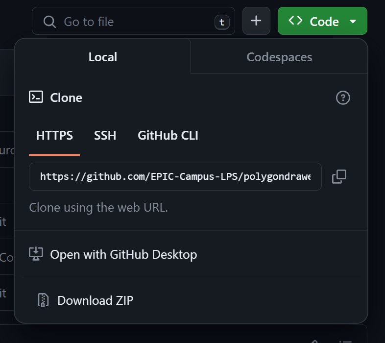
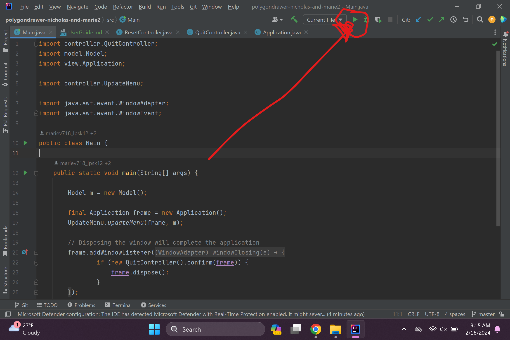

User Guide

1. Download IntelliJ IDEA Community Edition
   * Go to [this link](https://www.jetbrains.com/idea/download/?section=windows)
   * Scroll down to the black section
   * Download IntelliJ IDEA Community Edition

2. Get the program
   * Go to [this link](https://github.com/EPIC-Campus-LPS/polygondrawer-nicholas-and-marie)
   * Click the green code button
    
   * It should give you this menu
    
   * Click the two overlapped squares to copy the link
    

3. Open IntelliJ

4. Open the project
   * Go through the introduction until you get to this page
    
   * Click "Get from VCS" in the top right corner
    
   * Paste the previously copied link in the URL section
    
   * Click the blue "Clone" button in the bottom right corner
    

5. Once the project clones, run it
   * In the top right corner, select the green start button
    

6. Use the program!
   * You can left-click around the screen to add sides to polygons
     * Note: you need 3 dots before lines will appear
   * Right click to end the current polygon and make a new one
   * Use Ctrl-Z to undo
     * Note: If you click Ctrl-Z after right-clicking to complete a polygon, it will remove the entire polygon
   * Use Ctrl-N to clear everything